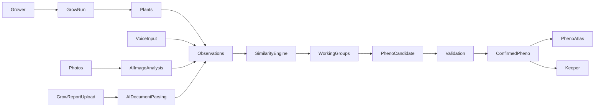
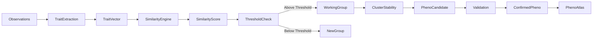

# MASTER TASK – HNTZ Case Study Evolution (Portfolio Update)

You have full access to the portfolio codebase of:

pascaljaeger.online

Your task is to **upgrade and extend the existing HNTZ case study**.

Important rules:

1. Do NOT rewrite the entire case study.
2. Preserve the existing structure and tone.
3. Extend the case study with new sections that explain the **evolution of the product**.
4. Maintain the analytical and product-thinking style of the portfolio.
5. Do not introduce marketing language.

The goal is to show that HNTZ evolved from a **phenotype tracking MVP into a phenotype discovery system**.

---

# CONTEXT

The existing case study already explains:

* Vision & Problem
* Competitive Analysis
* Information Architecture
* Design Pivot
* Cognitive Load Design
* Feature Prioritization
* Agile Development
* Technical Decisions
* System Architecture
* Learnings

However, the product has evolved significantly since the case study was written.

New features include:

* Voice observation input
* AI grow report import
* Photo trait analysis
* Phenotype discovery pipeline
* expanded system architecture

These features must now be integrated into the case study.

---

# WHERE TO INSERT THE NEW CONTENT

Add the new sections **after the existing section "09 Systemarchitektur"** and before "10 Learnings".

Do not modify earlier sections.

---

# NEW SECTION

## 10 Product Evolution

Introduce the real-world context that shaped the next iteration of the product.

Explain the actual working conditions of growers.

Example scenario:

A breeder walks through a greenhouse with 200 plants.

Conditions:

* high humidity
* gloves
* dirt
* constant movement between plants

Typing observations into a phone under these conditions is slow and impractical.

The product therefore evolved to support **low-friction data capture**.

---

# FEATURE 1 – Voice Observations

The system now supports voice-based observation input.

Workflow:

Grower speaks an observation
→ AI parses the description
→ trait values automatically populate slider fields

Example:

"Plant 27. Strong stretch. Citrus terpene. Slightly airy buds."

Converted into structured metrics:

stretch = 7
terpene = citrus
bud_density = 4

This allows growers to capture information immediately during greenhouse walkthroughs.

It dramatically reduces forgotten observations.

---

# FEATURE 2 – Grow Report Import

Many breeders already have years of phenotype data stored in:

* Excel sheets
* CSV exports
* PDFs
* text notes

The system now allows these documents to be uploaded.

Workflow:

Upload document
→ AI parses the document
→ grow structure reconstructed
→ plants created
→ observations generated
→ phenotype candidates detected

If the document does not contain meaningful phenotype data the import is rejected.

This protects **database integrity**.

The goal is a **high signal dataset**, not a noisy archive.

---

# FEATURE 3 – Photo Analysis

The system now supports AI-based analysis of plant photos.

Traits extracted from images include:

* bud density
* color expression
* internode distance
* leaf morphology

These traits are converted into structured data.

They feed directly into the phenotype similarity engine.

---

# FEATURE 4 – The Pheno Engine

HNTZ now uses a phenotype discovery pipeline.

Observation
→ Working Group
→ Pheno Candidate
→ Confirmed Pheno
→ Keeper

This pipeline prevents phenotype inflation.

Example:

1000 plants may result in only 4–6 confirmed phenotypes.

This ensures the phenotype atlas remains meaningful.

---

# DIAGRAM 1 – SYSTEM OVERVIEW

Insert a diagram explaining the full system flow.

Render this Mermaid diagram as SVG.

Section title:

## System Overview

Caption:

HNTZ transforms raw grow observations into phenotype discoveries using similarity analysis and validation.

---

# DIAGRAM 2 – INSIDE THE PHENO ENGINE

Insert another diagram explaining the internal logic of phenotype clustering.

Section title:

## Inside the Pheno Engine

Explanation text:

The system converts observations into normalized trait vectors.

Plants are compared using similarity scoring.

Clusters that remain stable across observations become phenotype candidates.

Candidates that pass validation thresholds are promoted to confirmed phenotypes.

---

# UX PRINCIPLE

Explain the core product philosophy:

HNTZ is not a grow diary.

It is a phenotype discovery system.

The interface exists to capture structured data that can later be compared algorithmically.

---

# DESIGN INTENTION

The purpose of the update is to demonstrate:

* real world usage context
* domain expertise
* system thinking
* architecture evolution
* AI integration

Avoid marketing language.

Maintain the analytical tone used in the existing case study.

---

# IMPLEMENTATION REQUIREMENTS

1. Render Mermaid diagrams as responsive SVG.
2. Ensure diagrams scale on mobile.
3. Keep existing typography and layout.
4. Do not remove existing content.
5. Preserve current case study structure.

---

# FINAL RESULT

After the update the HNTZ case study should clearly communicate:

* the original product thinking
* the MVP architecture
* the real-world testing context
* the evolution into a phenotype discovery platform
* the role of AI in the system

The portfolio should present HNTZ as a **system design project**, not only a UX interface.
